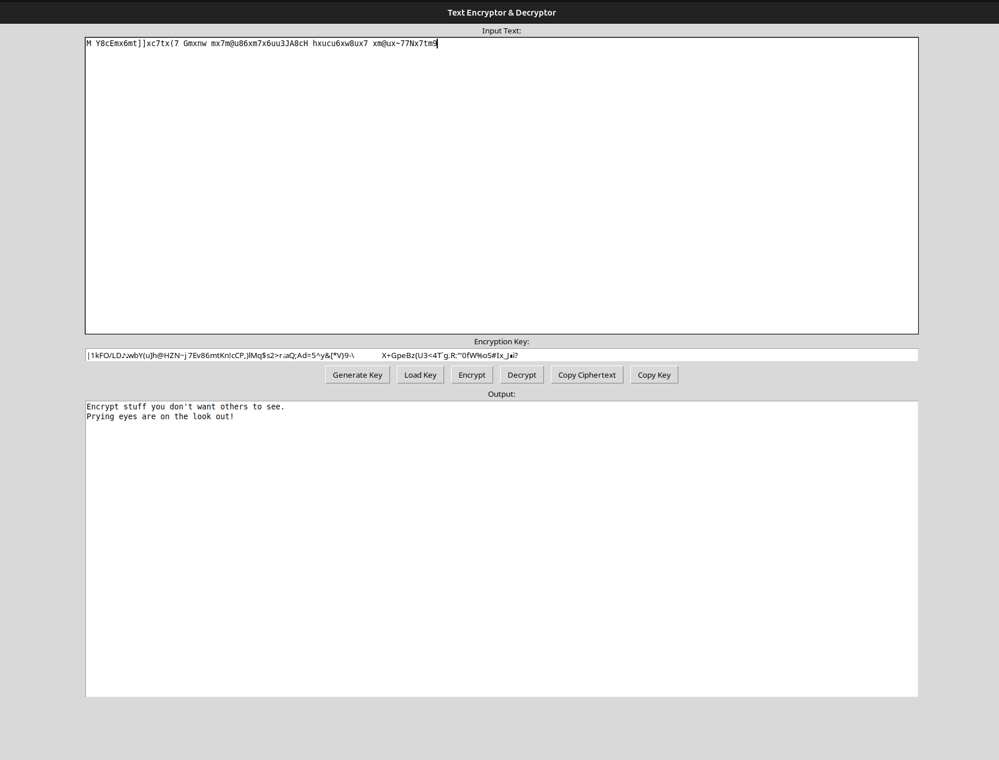
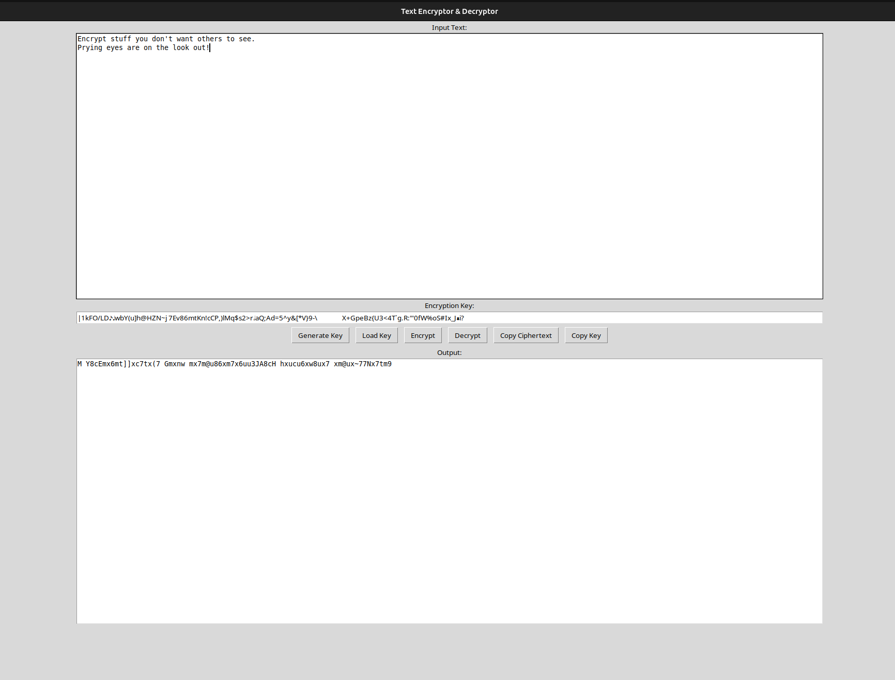

## Substitution Cipher - GUI Text Encryptor & Decryptor
This Python program provides a GUI-based text encryption and decryption tool using Tkinter. It implements a simple substitution cipher by shuffling all printable characters to create an encryption key, which can be generated, saved, loaded, and copied. Users can input text, encrypt or decrypt it using a key, and copy the results to the clipboard.

## Features
- Encrypt & Decrypt: Securely encode and decode messages using a randomized substitution cipher.
- Key Management: Generate, save, load, and copy encryption keys.
- Clipboard Support: Easily copy ciphertext and keys for quick use.
- User-Friendly Interface: Simple and intuitive GUI built with Tkinter.

## Installation
- Ensure you have Python installed, then clone this repository and run the script:
    git clone https://github.com/gdeng064/substitution-cipher.git
    cd substitution-cipher
    python3 substitution-cipher.py

## Usage
- Run the program and enter the text you want to encrypt.
- Click Generate Key to create an encryption key.
- Click Encrypt to encode the text.
- Copy and save the key for decryption later.
- Paste the encrypted text and the key to decrypt the message later.

Dependencies
- This program uses Python's built-in tkinter module, so no additional libraries are required.

## Author
- Gatjang Deng
- GitHub: gdeng064
